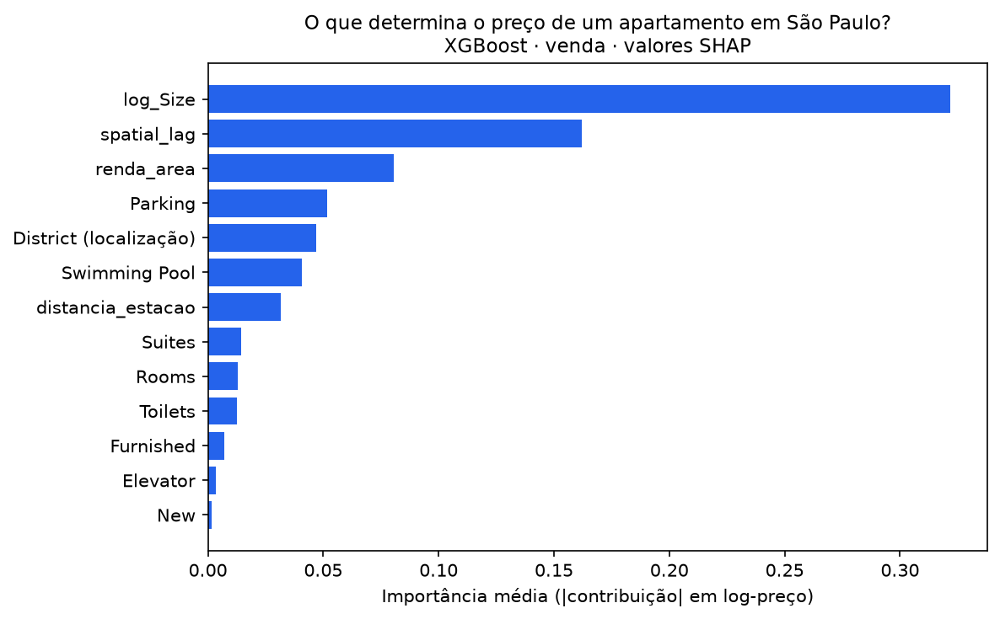
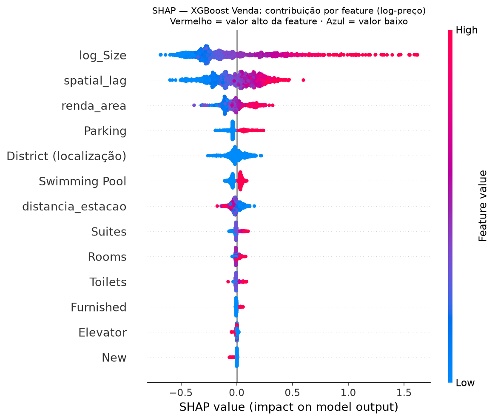
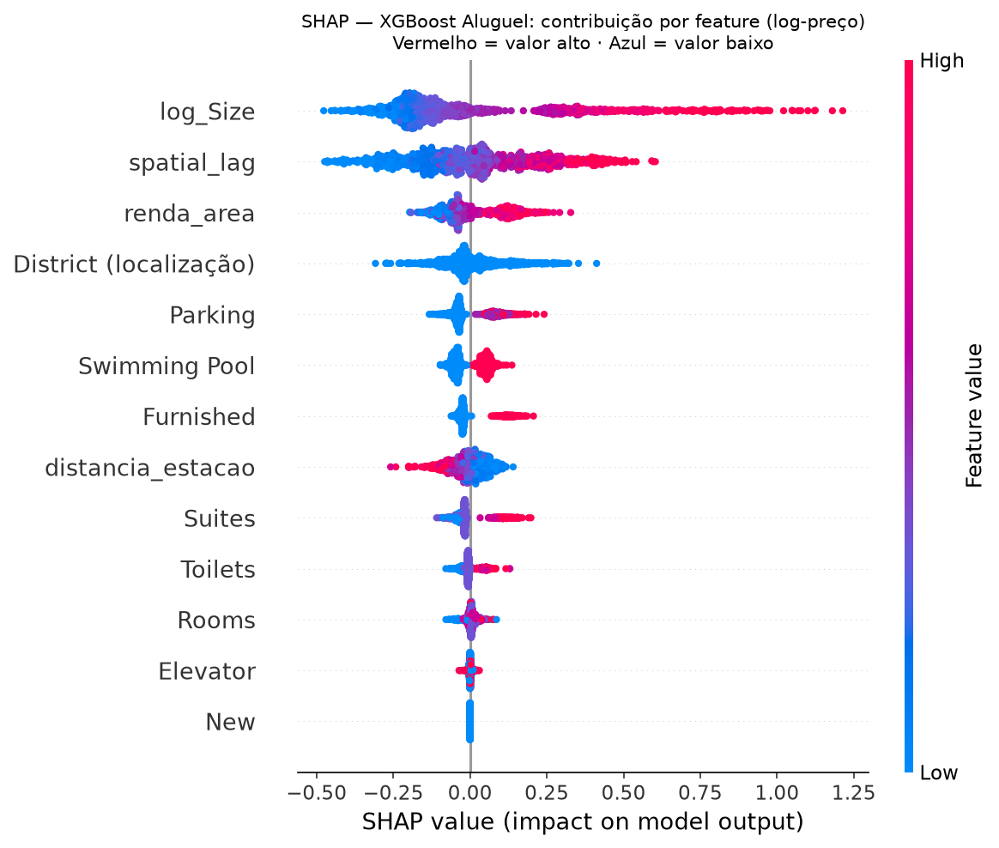

# AVM São Paulo — Avaliação de Apartamentos

Modelo de avaliação automatizada (*Automated Valuation Model*) para apartamentos no
município de São Paulo, exposto como aplicação web. A partir do **CEP** e das
**características** do imóvel, estima o preço de **venda ou aluguel** — com faixa de
incerteza e uma explicação dos fatores que mais pesaram.

### → **[Acessar o app](https://avm-sao-paulo.streamlit.app/)**

> **É um AVM-produto (estimativa de apoio), não um laudo.** Serve como apoio à decisão e
> defesa de valor — não substitui avaliação formal com validade jurídica (NBR 14653 / CREA).

Projeto desenvolvido no MBA em Data Science, IA e Analytics (USP/ESALQ).


---

## O problema

Corretores e avaliadores precisam estimar o preço de um apartamento rapidamente e
**defender esse número** para o cliente. As alternativas são a intuição (subjetiva,
difícil de justificar), a análise comparativa manual (lenta) ou o laudo formal (caro,
desproporcional para uma consulta). Falta uma ferramenta intermediária: rápida como a
intuição, mas **objetiva e explicável** como uma análise.

## A solução

Um AVM acessível pela web que recebe o CEP e os atributos do imóvel, deriva
automaticamente os fatores de localização a partir da coordenada, e retorna uma
estimativa de preço (número + faixa) com os fatores que mais pesaram — em linguagem de
negócio, não de modelo.

- **Modelos XGBoost** (um para venda, um para aluguel), com **MAPE de 14,0% (venda) e
  20,3% (aluguel)** no conjunto de teste — competitivo com a literatura brasileira de
  AVMs sobre dados de anúncio.
- **Dois modelos separados**, não um único: os preços implícitos dos atributos diferem
  estruturalmente entre comprar e alugar (ver achados abaixo).
- **Fatores espaciais finos** como diferencial: além de bairro e atributos físicos, o
  modelo usa *spatial lag* (preço do entorno imediato), proximidade de transporte e
  perfil socioeconômico da região.



---

## Achados que o modelo revelou

A interpretabilidade (SHAP) não só rankeia os fatores — revela como eles agem, e como
**venda e aluguel divergem no que dirige o preço**:

**A distância à estação inverte de sinal entre os mercados.** Na venda, estar *longe* do
metrô tende a *aumentar* o preço — os bairros mais valorizados de São Paulo (Jardins, Alto
de Pinheiros, Morumbi) são orientados ao carro e distantes de estações. No aluguel, o
efeito é o oposto: *perto* do metrô vale mais, porque o locatário depende mais de
transporte público. A mesma variável, direção contrária — o caso mais claro de por que
modelar os dois mercados separadamente.

**Mobília e imóvel novo importam quase só no aluguel.** Estar mobiliado agrega ~18% no
aluguel contra ~4% na venda; ser novo agrega ~25% no aluguel e praticamente nada na venda.
O locatário paga por pronto-para-morar; o comprador, por patrimônio.

**O *spatial lag* é o 2º fator mais importante** (atrás só do tamanho) e tem baixa
redundância com as demais variáveis — o preço do entorno imediato carrega informação
própria, validando a aposta na frente espacial.

<table>
<tr>
<td></td>
<td></td>
</tr>
<tr>
<td align="center"><b>Venda</b></td>
<td align="center"><b>Aluguel</b></td>
</tr>
</table>

---

## Rigor metodológico

O projeto trata a fidelidade dos dados como inegociável:

- **Anti-leakage desde a raiz.** O *train/test split* é feito antes de qualquer
  transformação que aprenda dos dados. O *spatial lag* — que usa o preço dos vizinhos — é
  reconstruído dentro de cada *fold* da validação cruzada, para um imóvel nunca "ver" o
  preço de vizinhos do próprio *fold*.
- **Baseline normativo antes do ML.** Começa por regressão linear (a tradição NBR 14653),
  com diagnósticos formais (VIF, normalidade, homocedasticidade). A reprovação desses
  pressupostos é o que justifica a migração para modelos de árvore — não uma escolha
  arbitrária por boosting.
- **Contemporaneidade temporal.** A base é de abril/2019; todo enriquecimento respeita
  essa janela (Censo 2010, estações de transporte existentes em 2019).
- **Contrato treino↔produção verificado.** O app replica o pipeline de *feature
  engineering* do notebook exatamente — verificado com diferença numérica nula entre a
  predição do app e a do notebook para o mesmo imóvel. (Detalhes em
  [`docs/SPEC_CONTRATO.md`](docs/SPEC_CONTRATO.md).)

---

## Como rodar localmente

```bash
python -m venv venv
# Windows: venv\Scripts\activate   |   Linux/Mac: source venv/bin/activate
pip install -r requirements.txt
streamlit run app/app.py
```

O pacote de dados de produção (`app/data/`) e os modelos (`models/`) já estão no
repositório — não é preciso baixar nada para estimar. A base bruta original (usada só
para re-treinar) é o dataset público
[São Paulo Real Estate · Sale/Rent · April 2019](https://www.kaggle.com/datasets/argonalyst/sao-paulo-real-estate-sale-rent-april-2019/data).

---

## Stack

Python · pandas · scikit-learn · XGBoost · geopandas · Streamlit

## Estrutura

- **`app/`** — aplicação: `app.py` (UI), `predictor.py` (inferência fiel ao modelo),
  `geocode.py` (CEP → coordenada via ViaCEP + Nominatim), `data/` (dados de produção).
- **`models/`** — modelos campeões (`.joblib`).
- **`docs/`** — contrato modelo↔app (`SPEC_CONTRATO.md`), jornadas de usuário e one-pager.
- **`01_auditoria.ipynb` · `02_preparacao.ipynb` · `03_modelagem.ipynb`** — auditoria,
  preparação, frente espacial, modelagem e interpretabilidade. Visão geral em
  [`PROJETO.md`](PROJETO.md).

---

## Limitações

- Estima preço de **anúncio**, não de transação (anúncio tende a ficar acima do
  fechamento).
- Base de **2019** — serve para demonstrar o método, não para precificar imóveis hoje.
- Escopo: **apartamentos no município de São Paulo**.

---
Desenvolvido por **Lucas Delmondes** · [LinkedIn](https://www.linkedin.com/in/delmondes-lucas/) · [GitHub](https://github.com/lDelmondes)